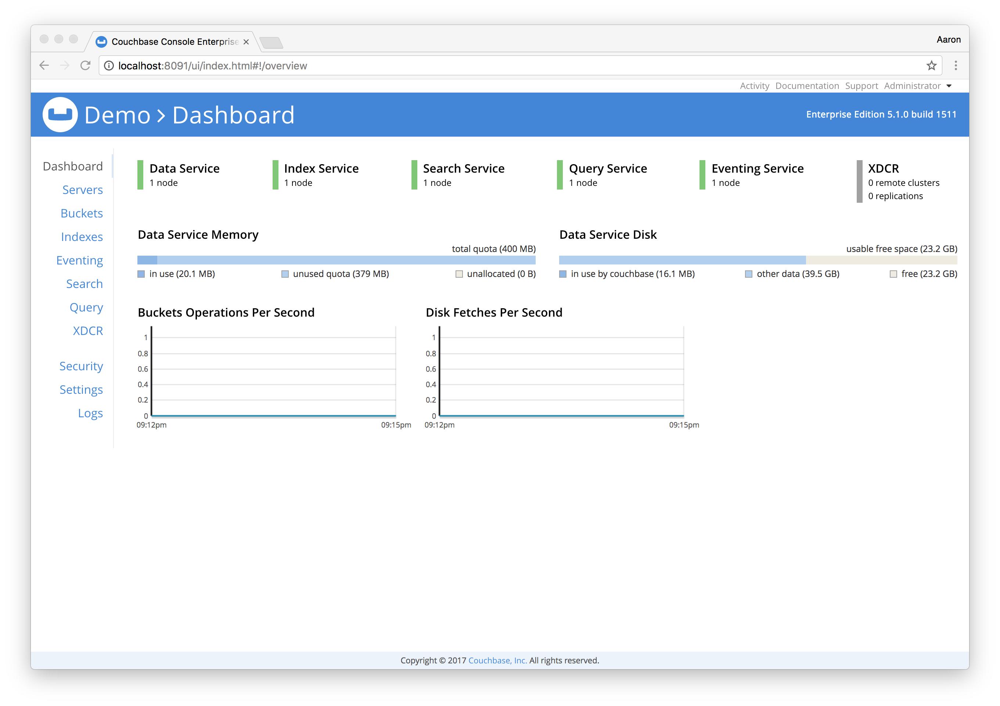
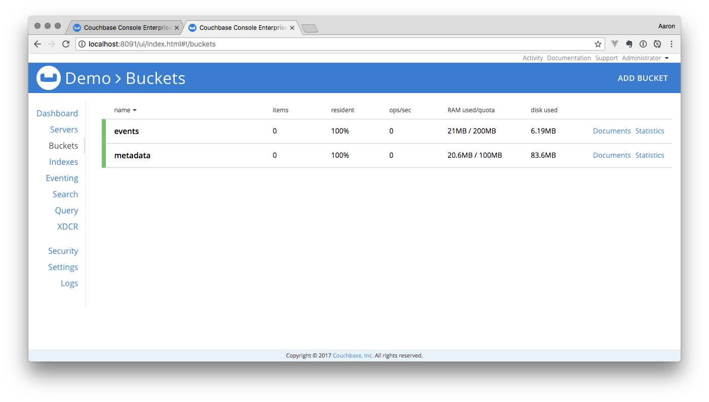

# Eventing Aggregate Demo

--

## Overview	

This demonstration will illustrate how to use the Eventing Service to create materialized views for fast KV access to aggregate counts.  

## Setup

Clone this repository

```bash
git clone https://github.com/bentonam/couchbase-eventing-aggregate-demo.git
```

`cd` into the project directory

Go ahead and open up the project in your favorite IDE, if you using Atom just run `atom .` from terminal

This demo runs in a single Docker container, from terminal run the following command:

**Note:** Replace `$URL_TO_BUILD` with a valid rpm build

```bash
docker-compose build \
	--build-arg PACKAGE_URL=$URL_TO_BUILD \
	couchbase
```

This will build and tag the container.  The build reference that I'm using at this time is #1511.

Now start the container

```bash
docker-compose up -d
```

After a few seconds, the Couchbase container will be up and running.  This container has the following services enabled:

- Data
- Index
- Search
- Query
- Eventing

You can open the admin console by going to [http://localhost:8091/ui/index.html]() in a web browser.  The default username is `Administrator` and the `password` is password.  You can change these if you'd like in the `docker-compose.yaml` file.  



Browse to the [Buckets](http://localhost:8091/ui/index.html#!/buckets) tag and you will see there is two buckets created for you `events` and `metadata`



## Models

This is a Events / Calendar application.  We're using a single application model, and 2 models generated by our application service.  

### Event

```json
{
    "_id": "event::44cef362-56a6-4edf-9267-957d100f05dc",
    "_type": "event",
    "event_id": "44cef362-56a6-4edf-9267-957d100f05dc",
    "event_name": "Ded vega wu rerekeg wuusufa mo.",
    "event_date": "2016-11-18T10:41:53.712Z",
    "attendees": 12
  }
```

### Event Date Aggregate

```json
{
	"_id": "event::agg::2018-01-15",
	"_type": "agg-date",
	"event_date": "2018-01-15",
	"events": [
		"ba063e7d-9ca5-4bb4-af32-2bedf5ee2011",
		"968b3b26-f988-4709-975b-681e25ef3d1f",
		"e8db3dfe-b19a-489f-957d-a89138b81e05",
		"36407ed3-fd42-42df-b50d-2370f3cca7a4",
		"08202275-25cd-48e3-8021-1f7fc4e2961d"
	],
	"total": 5
}
```

### Event Month Aggregate

```json
{
	"_id": "event::agg::2018-01-15",
	"_type": "agg-month",
	"event_month": "2018-01",
	"events": [
		"ba063e7d-9ca5-4bb4-af32-2bedf5ee2011",
		"968b3b26-f988-4709-975b-681e25ef3d1f",
		"e8db3dfe-b19a-489f-957d-a89138b81e05",
		"36407ed3-fd42-42df-b50d-2370f3cca7a4",
		"08202275-25cd-48e3-8021-1f7fc4e2961d"
		...
	],
	"total": 5
}
```


## Events

We will be using 2 separate eventing functions to create materialized views.  This will allow us to use N1QL KV operations without the need for a Secondary Index, Analytics or Views (to be deprecated).

### Aggregate Date Function

From the Admin Console, click on "Eventing"

Click "Add" and fill out the following and then click "Continue"

```
Source bucket: events
Metadata bucket: metadata
Name: func_aggregate_date
Description:
	This eventing functions handles building an aggregate document for a specific YEAR-MONTH-DATE combination
RBAC username: Administrator
RBAC password: password
```

Click "Continue"

This will deploy a shell of our function that looks similar to:


Paste the following code into the editor:

```js
function OnUpdate(doc, meta) {
    try {
        if (doc._type === 'event') {
            // set the date 
            var date = new Date(doc.event_date).toISOString().split('T')[0];
            // set the id to use 
            var agg_id = 'event::agg::' + date;
            // see if the document exists already or not
            var query = SELECT e.* FROM `events` AS e USE KEYS [ :agg_id ];
            var result = query.execQuery();
            // set the document
            var agg_doc = null; 
            if (result.length) { // the document already exists
                agg_doc = result[0];
                // check to see if the documents event_id is already present
                // only add it, update the total and upsert it if it doesn't
                if (agg_doc.events.indexOf(doc.event_id) === -1) {
                    agg_doc.events.push(doc.event_id);
                    agg_doc.total += 1;
                    var ups = UPSERT INTO `events` (KEY, VALUE)
                            VALUES(:agg_id, JSON_DECODE(:agg_doc));
                    ups.execQuery();
                }
            } else { // the document does not exist yet 
                var agg_doc = {
                    _id: agg_id,
                    _type: 'agg-date',
                    event_date: date,
                    total: 1,
                    events: [ doc.event_id ]
                };
                var ins = INSERT INTO `events` (KEY, VALUE)
                            VALUES(:agg_id, JSON_DECODE(:agg_doc));
                ins.execQuery();
            }
        }
    } catch (err) {
        log('Error', err);
    }
}
function OnDelete(meta) {
}
```

Deploy the Function

1. Click on "Eventing"
2. Click on your newly defined function `func_aggregate_date`
3. Click on "Deploy", leave the defaults
4. Click "Deploy Function"

### Aggregate Month Function

From the Admin Console, click on "Eventing"

Click "Add" and fill out the following and then click "Continue"

```
Source bucket: events
Metadata bucket: metadata
Name: func_aggregate_month
Description:
	This eventing functions handles building an aggregate document for a specific YEAR-MONTH combination
RBAC username: Administrator
RBAC password: password
```

Click "Continue"

Paste the following code into the editor:

```js
function OnUpdate(doc, meta) {
    try {
        if (doc._type === 'event') {
            // set the date 
            var date = new Date(doc.event_date).toISOString().split('T')[0].split('-');
            date = date[0] + '-' + date[1]; // YEAR-MONTH
            // set the id to use 
            var agg_id = 'event::agg::' + date;
            // see if the document exists already or not
            var query = SELECT e.* FROM `events` AS e USE KEYS [ :agg_id ];
            var result = query.execQuery();
            // set the document
            var agg_doc = null; 
            if (result.length) { // the document already exists
                agg_doc = result[0];
                // check to see if the documents event_id is already present
                // only add it, update the total and upsert it if it doesn't
                if (agg_doc.events.indexOf(doc.event_id) === -1) {
                    agg_doc.events.push(doc.event_id);
                    agg_doc.total += 1;
                    var ups = UPSERT INTO `events` (KEY, VALUE)
                            VALUES(:agg_id, JSON_DECODE(:agg_doc));
                    ups.execQuery();
                }
            } else { // the document does not exist yet 
                var agg_doc = {
                    _id: agg_id,
                    _type: 'agg-month',
                    event_month: date,
                    total: 1,
                    events: [ doc.event_id ]
                };
                var ins = INSERT INTO `events` (KEY, VALUE)
                            VALUES(:agg_id, JSON_DECODE(:agg_doc));
                ins.execQuery();
            }
        }
    } catch (err) {
        log('Error', err);
    }
}
function OnDelete(meta) {
}
```

Deploy the Function

1. Click on "Eventing"
2. Click on your newly defined function `func_aggregate_month`
3. Click on "Deploy", leave the defaults
4. Click "Deploy Function"


## Load Dataset

Now that our eventing functions are defined, we'll load `10,000` events into our bucket. 

```bash
docker exec eventing-couchbase \
	fakeit couchbase \
	--server localhost \
	--username Administrator \
	--password password \
	--bucket events \
	--count 10000 \
	--use-streams true \
	--high-water-mark 512 \
	--seed eventing \
	/usr/data/models/events.yaml
```

## Queries

If we were to define an index to query our dataset to find aggregate counts by dates it my look something similar to the following:

##### Index

```sql
CREATE INDEX `idx_event_aggregates` ON `events` (event_date)
WHERE _type = 'event'
```

##### Query: Aggregate By Date

```sql
SELECT COUNT(1) AS total
FROM `events`
WHERE event_date >= '2018-01-15T00:00:00.000Z'
	AND event_date <= '2018-01-15T23:59:59.999Z'
	AND _type = 'event';
```

##### Query: Aggregate By Month

```sql
SELECT COUNT(1) AS total
FROM `events`
WHERE event_date >= '2018-01-01T00:00:00.000Z'
    AND event_date <= '2018-01-31T23:59:59.999Z'
    AND _type = 'event'
```

##### Query: Aggregate By Year

```sql
SELECT COUNT(1) AS total
FROM `events`
WHERE event_date >= '2018-01-01T00:00:00.000Z'
    AND event_date <= '2018-12-31T23:59:59.999Z'
    AND _type = 'event'
```

Now we'll implement these same queries using the materialized views that our eventing function created for us.  

##### Query: Aggregate By Date

```sql
SELECT total
FROM `events`
USE KEYS 'event::agg::2018-01-15';
```

##### Query: Aggregate By Month

```sql
SELECT total
FROM `events`
USE KEYS 'event::agg::2018-01';
```

##### Query: Aggregate By Year

```sql
SELECT SUM(total) AS total
FROM events
USE KEYS [
  'event::agg::2018-01',
  'event::agg::2018-02',
  'event::agg::2018-03',
  'event::agg::2018-04',
  'event::agg::2018-05',
  'event::agg::2018-06',
  'event::agg::2018-07',
  'event::agg::2018-08',
  'event::agg::2018-09',
  'event::agg::2018-10',
  'event::agg::2018-11',
  'event::agg::2018-12'
]
```

